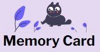

<!-- Improved compatibility of back to top link: See: https://github.com/othneildrew/Best-README-Template/pull/73 -->
<a name="readme-top"></a>

<!-- PROJECT SHIELDS -->
<!--
*** I'm using markdown "reference style" links for readability.
*** Reference links are enclosed in brackets [ ] instead of parentheses ( ).
*** See the bottom of this document for the declaration of the reference variables
*** for contributors-url, forks-url, etc. This is an optional, concise syntax you may use.
*** https://www.markdownguide.org/basic-syntax/#reference-style-links
-->
<!-- [![Contributors][contributors-shield]][contributors-url] -->
<!-- [![Forks][forks-shield]][forks-url]
[![Stargazers][stars-shield]][stars-url]
[![Issues][issues-shield]][issues-url]
[![MIT License][license-shield]][license-url]
[![LinkedIn][linkedin-shield]][linkedin-url] -->

<!-- PROJECT LOGO -->
<br />
<div align="center">
  <a href="https://github.com/mikeyCos/cv-application">
    
  </a>

<h3 align="center">Memory Card</h3>

  <p align="center">
    Memory card is a simple game where each card must be clicked only once.
    <br />
    <a href="https://memorycard-mikeycos.netlify.app/">Live Preview</a>
    <!-- ·
    <a href="https://github.com/github_username/repo_name/issues/new?labels=bug&template=bug-report---.md">Report Bug</a>
    ·
    <a href="https://github.com/github_username/repo_name/issues/new?labels=enhancement&template=feature-request---.md">Request Feature</a> -->
    ·
    <a href="https://github.com/mikeyCos/memory-card/blob/main/CHANGELOG.md">Changelog</a>
  </p>
</div>


<!-- TABLE OF CONTENTS -->
<details>
  <summary>Table of Contents</summary>
  <ol>
    <li>
      <a href="#about-the-project">About The Project</a>
      <ul>
        <li><a href="#built-with">Built With</a></li>
      </ul>
    </li>
    <li>
      <a href="#getting-started">Getting Started</a>
      <ul>
        <li><a href="#prerequisites">Prerequisites</a></li>
        <li><a href="#installation">Installation</a></li>
      </ul>
    </li>
    <li><a href="#usage">Usage</a></li>
    <li><a href="#roadmap">Roadmap</a></li>
    <li><a href="#contributing">Contributing</a></li>
    <!-- <li><a href="#contact">Contact</a></li> -->
    <li><a href="#acknowledgments">Acknowledgments</a></li>
    <li><a href="#questions">Questions</a></li>
  </ol>
</details>


<!-- ABOUT THE PROJECT -->
## About The Project

[![Memory Card Screen Shot][product-screenshot]](https://memorycard-mikeycos.netlify.app/)

Project: Memory Card

Hello world,

This is my second React project and it involves cats! On load, the application renders six clickable random cat pictures, a scoreboard, a slider, and instructions on what to do. The main objective of the game is to click all images only once. For example, if there are six pictures, then a user must click each image once. If a user clicks an image more than once, the user has lost and the game is over. Anytime a unique image is clicked, the set of images are shuffled. The project focuses on implementing `useState` and `useEffect` React hooks. I also took the liberty to use the React hook `useRef`.

I implemented more than what was required in the project specifications. I created a pop up to communicate whether or not a user has won or lost. When a game is over, a pop up appears prompting if the user wants to play a new game or try again. If a user clicks on the "New game" button, then the pop up closes, and a new set of images are rendered. If a user clicks on the "Try again" button, then the pop up closes, and the current set of images are shuffled.

I also created a `Notifications` component. This component will fetch a random cat fact only when a user clicks an image and while the game is in play, otherwise a default message will be displayed. In this case, the default message will be a brief instruction on how to play the game. Whenever the game ends, the default message will display again.

Furthermore, I created a slider component for which increases or decreases the amount of images. This is my first time working with an input type of `range` and it controls the number of images to be rendered. If a user moves the slider one step to the right, the slider's value will change from 6 to 9. Since the input's `step` attribute is equal to 3, the input's value will increase or decrease by 3 depending on the direction the thumb moves.

A problem arose when a user quickly moves the slider's thumb left to right or right to left then left to right. This caused the amount of images be either more or less than the slider's value. I suspect whichever API request resolves first is what gets rendered. Once the request resolves and rendered, the current slider's value is ignored. One solution I put to use is debouncing, which before I was unaware of such. In order this to work, I created an `onChangeHandler` for the slider, and this handler will be debounced. Debouncing the `onChangeHandler` will make the onChange event from running frequently. Now, the API requests will not happen as much as the slider's value changes. Note, the API requests get called because of the `cardCount` dependency. The `onChangeHandler` calls `setCardCount`, then the useEffect with `cardCount` dependency will synchronize and pass `cardCount` as an argument when an API request is made. Little did I no, this solution revealed another problem.

Despite debouncing the `onChangeHandler`, now the value of the slider's input does not change. By not change, I mean if the slider's value is defined with a prop, for example `<input value={cardCount} />` and if cardCount is 6, the value recorded in the `onChangeHandler` will always be 6 despite trying to move the slider's thumb. I still do not really understand why this happens but I suspect since the input's attributes' value is equal to `cardCount`, and `cardCount` is initially 6, then the input's value will always be it's initial value. I attempted creating a state for the `Slider` component to update it's state when the `onChangeHandler` instead of depending on `cardCount` and nothing was resolved. Oddly enough, defining `defaultValue={cardCount}` and removing `value={cardCount}` seems to resolve the issue. This will make the input uncontrolled despite passing `cardCount` to `defaultValue`. However, I do notice `cardCount` in `.slider-output` does not synchronize quickly when the slider's thumb is moved quickly. Note, this solution and debouncing the `onChangeHandler` only masks the previous problem.

Another problem I encountered involved creating a pop up that notifies the user the game is over and whether or not they won or lost. The pop up, a dialog element, consists of a game message and two buttons. If a user clicks the first button, "New game", a new set of images will render. If a user clicks the second button, "Try again?", the current sent of images will shuffle. Both buttons `onClick` will also close the pop up. At first, I did not know how to have each button have their own behavior and they originally both created a new set of images. In order to achieve this, I defined a reference, `gameStatusRef`, and set it's `current` in the `Cards` component module.

I enjoyed creating this project, especially using APIs related to cats. I do notice some problems I would like to fix, but I am satisfied with the project's current state. After this project, I am feeling a bit more comfortable working with useState and useEffect React hooks.

To failing forward, cheers!

<p align="right">(<a href="#readme-top">back to top</a>)</p>


### Built With

* [![React][React.js]][React-url]
* 

<p align="right">(<a href="#readme-top">back to top</a>)</p>


<!-- GETTING STARTED -->
## Getting Started

This is an example of how you may give instructions on setting up your project locally.
To get a local copy up and running follow these simple example steps.

### Prerequisites

This is an example of how to list things you need to use the software and how to install them.
* npm
  ```sh
  npm install npm@latest -g
  ```

### Installation

1. Clone repository
      1. Clone [memory-card repository](https://github.com/mikeyCos/memory-card) using HTTPS/SSH/GitHub CLI; [more on cloning a repository](https://docs.github.com/en/repositories/creating-and-managing-repositories/cloning-a-repository).
      2. Navigate to cloned repository.
      3. Remove `.git` folder.
      4. Run `git init`.
      5. Run `git branch -M main`.
      6. Create a new repository on GitHub.
      7. Run `git remote add origin REPLACE_WITH_SSH_OR_HTTPS`.
      8. Run `git add . && git commit`.
2. Navigate to local repository and install NPM packages with `npm install`.

<p align="right">(<a href="#readme-top">back to top</a>)</p>


<!-- USAGE EXAMPLES -->
## Usage

Move the slider's thumb left or right to increase or decrease the amount of cards. Click all cards only once. For example, if there are six cards, then a user must click each card once. If a user clicks an card more than once, the user has lost and the game is over. Anytime a unique card is clicked, the set of cards are shuffled.

[![Memory Card Gif][demo-overview-gif]](./demo/demo_overview.gif)

_For more examples, please refer to the [Demo](./demo/DEMO.md)_

<p align="right">(<a href="#readme-top">back to top</a>)</p>


<!-- ROADMAP -->
## Roadmap

- [x] Initiate skeleton directories/components/stylesheets.
- [x] Fetch data from an API.
  - [ ] Implement a way to cancel past fetch requests.
- [x] Create a scoreboard component.
  - [x] Update current score when a user clicks an image.
  - [x] If user clicks an already clicked image, save current score into best score when a user clicks, reset current score to 0 and fetch a new collection of images.
- [x] Create an input slider that increases and decreases the amount of 'cards' by setting a state it's inputs' value.
  - [x] Remember the best score for each slider's value when a user moves the slider.
- [x] Create a pop up when a game has ended.
 - [x] Create a button to play a new game; uses new cards/images.
 - [x] Create a button to play again; uses the same cards/images.

<p align="right">(<a href="#readme-top">back to top</a>)</p>

<!-- CONTACT -->
<!-- ## Contact

Your Name - [@twitter_handle](https://twitter.com/twitter_handle) - email@email_client.com

Project Link: [https://github.com/mikeyCos/memory-card](https://github.com/mikeyCos/memory-card)

<p align="right">(<a href="#readme-top">back to top</a>)</p> -->


<!-- ACKNOWLEDGMENTS -->
## Acknowledgments

* [Best README Template](https://github.com/othneildrew/Best-README-Template)
* [The Cat API](https://thecatapi.com/)
* [Meow Facts API](https://github.com/wh-iterabb-it/meowfacts)

<p align="right">(<a href="#readme-top">back to top</a>)</p>


<!-- QUESTIONS -->
## Questions

1. When and where does it make sense to define a component's event handler? For example, passing props down to the `Card` component, declaring an the event handler in that component while using some, if not all, those props inside the event handler. 

```js
function Card({
  cardCount,
  setCards,
  shuffleCards,
  currentScore,
  setCurrentScore,
  setBestScore,
}) {
  return (
    <div
      className="card"
      onClick={() => {
        if (isClicked) {
          setCurrentScore(0);
          setBestScore(currentScore);
          buildArray(cardCount, setCards);
        } else {
          setIsClicked(true);
          setCurrentScore(currentScore + 1);
          shuffleCards();
        }
      }}
    >
    </div>
  );
}

```
In contrast, declaring the event handler in the parent component; in this case, the `Cards` component. This way, less props are needed to pass down to the `Card` component, and the event handler can be passed down as a prop.
```js
function Cards({
  currentScore,
  bestScore,
  setCurrentScore,
  setBestScore,
}) {
  const [cardCount, setCardCount] = useState(6);
  const [cards, setCards] = useState(null);

  const onClickHandler = (isClicked, setIsClicked) => {
    if (isClicked) {
      setCurrentScore(0);
      if (currentScore > bestScore) setBestScore(currentScore);
      buildArray(cardCount, setCards);
    } else {
      setIsClicked(true);
      setCurrentScore(currentScore + 1);
      setCards(shuffleCards(cards));
    }
  };

  useEffect(() => {
    buildArray(cardCount, setCards);
  }, [cardCount]);

  return (
    <>
      <Slider
        cardCount={cardCount}
        currentScore={currentScore}
        bestScore={bestScore}
        setCardCount={setCardCount}
        setCurrentScore={setCurrentScore}
        setBestScore={setBestScore}
      />
      <section id="cards">
        <div className="cards-container">
          {cards?.map((item) => (
            <Card
              key={item.id}
              item={item}
              onClickHandler={onClickHandler}
            />
          ))}
        </div>
      </section>
    </>
  );
}
```

2. How can I cancel previous fetch requests with the `AbortController` interface? I attempted by defining the interface as `const controller = new AbortController();`. First, a `useRef` variable, `fetchRef`, is check if it exists and a controller exists on `fetchRef`, then the `abort` method is called. Afterwards, a new controller is attached onto `fetchRef`. This solution does not seem to work.

<p align="right">(<a href="#readme-top">back to top</a>)</p>


<!-- MARKDOWN LINKS & IMAGES -->
<!-- https://www.markdownguide.org/basic-syntax/#reference-style-links -->

[contributors-shield]: https://img.shields.io/github/contributors/github_username/repo_name.svg?style=for-the-badge
[contributors-url]: https://github.com/github_username/repo_name/graphs/contributors
[forks-shield]: https://img.shields.io/github/forks/github_username/repo_name.svg?style=for-the-badge
[forks-url]: https://github.com/github_username/repo_name/network/members
[stars-shield]: https://img.shields.io/github/stars/github_username/repo_name.svg?style=for-the-badge
[stars-url]: https://github.com/github_username/repo_name/stargazers
[issues-shield]: https://img.shields.io/github/issues/github_username/repo_name.svg?style=for-the-badge
[issues-url]: https://github.com/github_username/repo_name/issues
[license-shield]: https://img.shields.io/github/license/github_username/repo_name.svg?style=for-the-badge
[license-url]: https://github.com/github_username/repo_name/blob/master/LICENSE.txt
[linkedin-shield]: https://img.shields.io/badge/-LinkedIn-black.svg?style=for-the-badge&logo=linkedin&colorB=555
[linkedin-url]: https://linkedin.com/in/linkedin_username
[product-screenshot]: ./src/assets/media/project_screeshot_00.png
[Next.js]: https://img.shields.io/badge/next.js-000000?style=for-the-badge&logo=nextdotjs&logoColor=white
[Next-url]: https://nextjs.org/
[React.js]: https://img.shields.io/badge/React-20232A?style=for-the-badge&logo=react&logoColor=61DAFB
[React-url]: https://reactjs.org/
[Vue.js]: https://img.shields.io/badge/Vue.js-35495E?style=for-the-badge&logo=vuedotjs&logoColor=4FC08D
[Vue-url]: https://vuejs.org/
[Angular.io]: https://img.shields.io/badge/Angular-DD0031?style=for-the-badge&logo=angular&logoColor=white
[Angular-url]: https://angular.io/
[Svelte.dev]: https://img.shields.io/badge/Svelte-4A4A55?style=for-the-badge&logo=svelte&logoColor=FF3E00
[Svelte-url]: https://svelte.dev/
[Laravel.com]: https://img.shields.io/badge/Laravel-FF2D20?style=for-the-badge&logo=laravel&logoColor=white
[Laravel-url]: https://laravel.com
[Bootstrap.com]: https://img.shields.io/badge/Bootstrap-563D7C?style=for-the-badge&logo=bootstrap&logoColor=white
[Bootstrap-url]: https://getbootstrap.com
[JQuery.com]: https://img.shields.io/badge/jQuery-0769AD?style=for-the-badge&logo=jquery&logoColor=white
[JQuery-url]: https://jquery.com 
[demo-overview-gif]: ./demo/demo_overview.gif